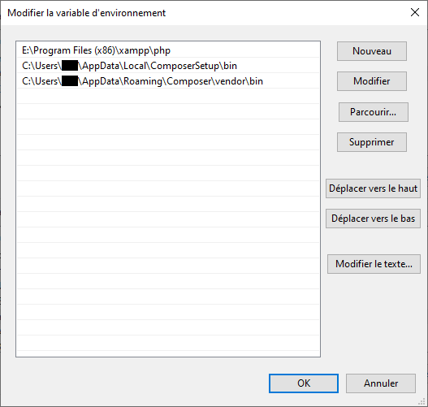
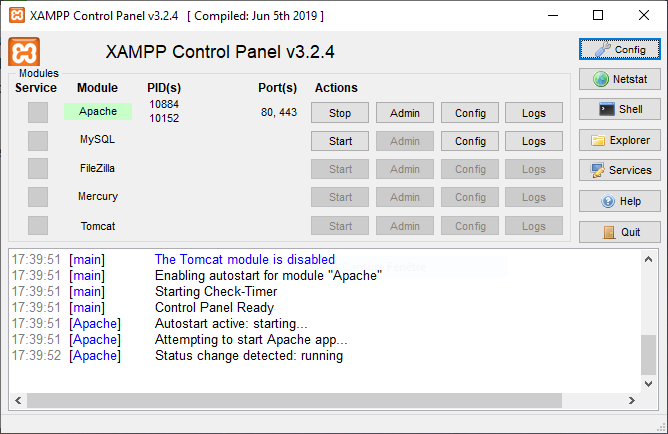

## Requirements

- PHP 7.1.3 or higher. - supplied with MAMP / XAMPP ([see below](#localhost)) - Check the [required modules list](https://learn.getgrav.org/basics/requirements#php-requirements)
- [Composer](https://getcomposer.org/download/)
- [Symfony](https://symfony.com/download)

---

Check that the installation is correctly configured in your environment variables:

### On Windows 10

 

Click on **[Environment variables ...]**

 

Double click on **PATH** from *User variables*...

 

... and check that the paths of the **php** and **composer/bin** folders are present

 

Double click on **Path** from *System Variables*...

 

... then check the presence of the paths of the **php**, **composer/bin** and **symfony** folders, e.g.

 

## localhost

### Mac
[MAMP/MAMP Pro](mamp.info) comes with Apache, MySQL and of course PHP. It is a great way to get more control over which version of PHP you are running, setting up virtual hosts, plus other useful features such as automatically handling dynamic DNS.

### Windows
[XAMPP](https://www.apachefriends.org/index.html) provides Apache, PHP, and MySQL in one simple package.

 

## Installation

Simply extract [the ZIP archive](https://github.com/nstardust/accrobranche--projet-cesi/archive/main.zip) in the xampp\\**htdocs** folder

While holding down the **Shift &#8679;** key, right click on the htdocs\\**accrobranche--project-cesi** folder and select "Open a command window here" (or "Open PowerShell window here ")

- From the console, type ``composer install``
- Once the installation is complete, type ``composer update``
- Finally, type ``composer install`` in each installed plugins folder with a *composer.json*, e.g. user/plugins/admin

Start Apache, e.g.

 

To check that the installation has been carried out, type "localhost" in your browser and open the project archive **accrobranche--project-cesi**