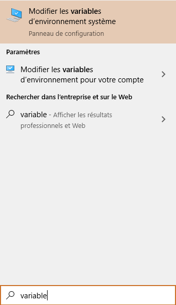
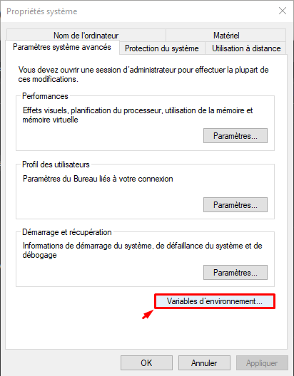
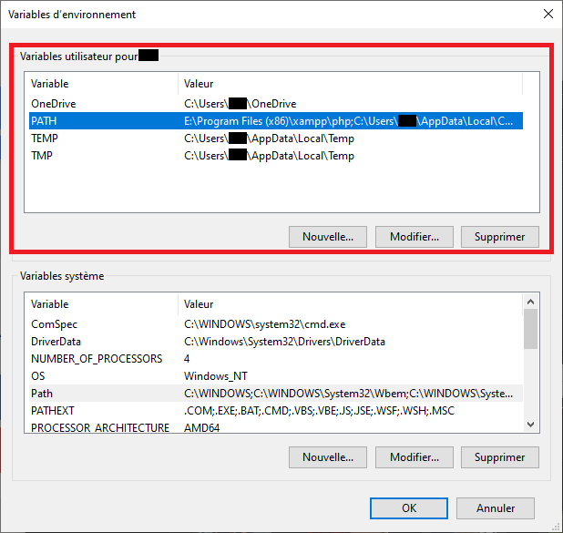
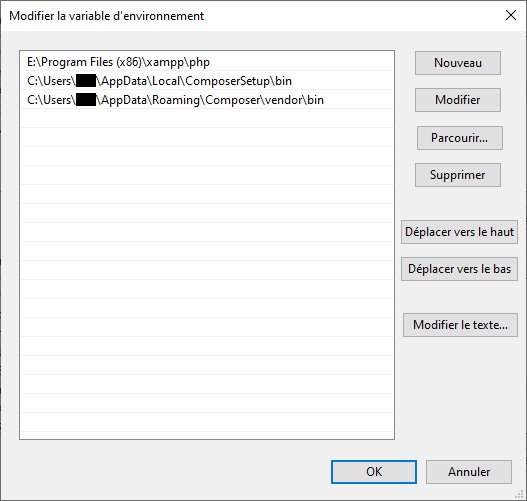
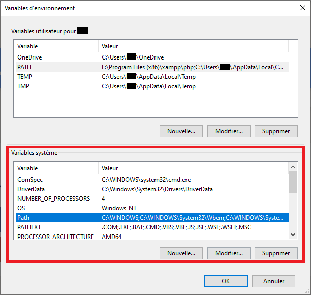
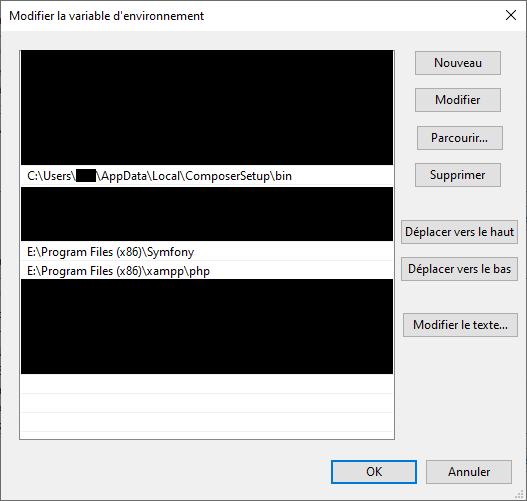
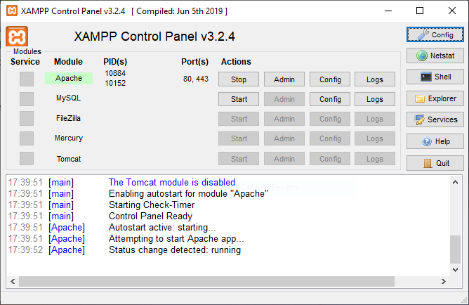

## Pré-requis

- PHP 7.1.3 ou plus. - fournit avec MAMP / XAMPP ([voir ci-dessous](#localhost)) - Vérifier la [liste des modules requis [en]](https://learn.getgrav.org/basics/requirements#php-requirements)
- [Composer](https://getcomposer.org/download/)
- [Symfony](https://symfony.com/download)

---

Vérifier que l'installation est bien configuré dans vos variables d'environnement :

### Sous Windows 10

 

Cliquez sur **[Variables d'environnement...]**

 

Double-cliquez sur **PATH** depuis *Variables utilisateur*...

 

...et vérifiez que les chemins des dossiers **php** et **composer/bin** sont présents, e.g.

 

Double-cliquez sur **Path** depuis *Variables système*...

 

...puis vérifiez la présence des chemins des dossiers **php**, **composer/bin** et **symfony**, e.g.

 

## localhost

### Mac
[MAMP/MAMP Pro](mamp.info) est livré avec Apache, MySQL et bien sûr PHP. C'est un excellent moyen d'obtenir plus de contrôle sur la version de PHP que vous utilisez, la configuration d'hôtes virtuels, ainsi que d'autres fonctionnalités utiles telles que la gestion automatique du DNS dynamique.

### Windows
[XAMPP](https://www.apachefriends.org/fr/index.html) fournit Apache, PHP et MySQL dans un package simple.

 

## Installation

Extrayez simplement [l'archive ZIP](https://github.com/nstardust/accrobranche--projet-cesi/archive/main.zip) dans le dossier xampp\\**htdocs**

Tout en maintenant la touche **Maj &#8679;** enfoncée, faites un clic droit sur le dossier htdocs\\**accrobranche--projet-cesi** et sélectionnez "Ouvrir une fenêtre de commandes ici" (ou "Ouvrir la fenêtre PowerShell ici")

- Depuis la console, taper ``composer install``
- Une fois l'installation terminée, taper ``composer update``

Démarrez Apache, e.g.

 

Pour vérifier que l'installation a bien été effectué, taper "localhost" dans votre navigateur et ouvrez l'archive du projet **accrobranche--projet-cesi**